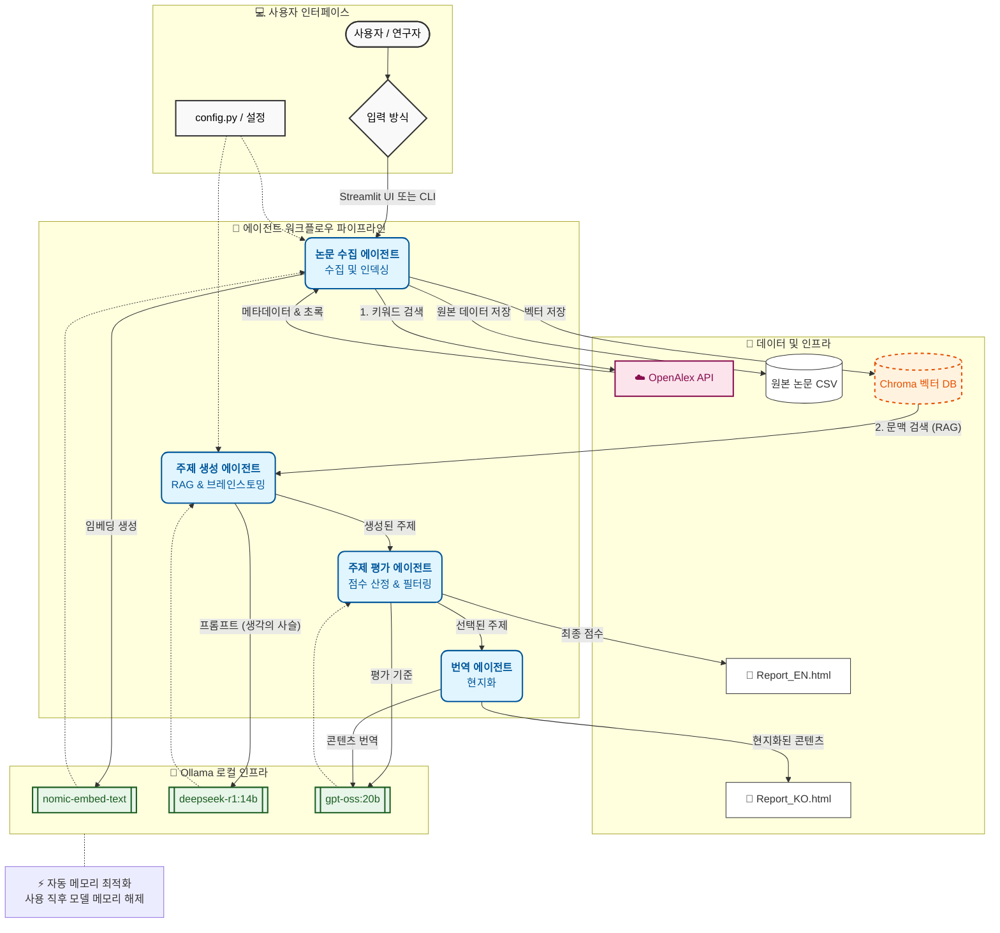

# 멀티 에이전트 연구 주제 브레인스토밍 도구

[](https://www.python.org/)
[](https://ollama.ai/)
[](https://www.docker.com/)
[](https://streamlit.io/)
[](https://www.langchain.com/)
[](https://www.trychroma.com/)

> OpenAlex API의 학술 논문을 기반으로 혁신적인 연구 방향을 발견하기 위해 여러 전문 에이전트를 활용하는 **AI 기반 연구 주제 생성 및 평가 시스템**입니다.

---

## 📋 목차

- [개요](#개요)
- [기능](#기능)
- [아키텍처](#아키텍처)
- [필수 요구 사항](#필수-요구-사항)
- [설치](#설치)
- [설정](#설정)
- [사용법](#사용법)
- [프로젝트 구조](#프로젝트-구조)
- [작동 방식](#작동-방식)
- [출력](#출력)
- [사용자 정의](#사용자-정의)
- [문제 해결](#문제-해결)
- [기여하기](#기여하기)
- [라이선스](#라이선스)

---

## 🎯 개요

이 도구는 연구자들이 새로운 연구 주제를 브레인스토밍할 수 있도록 돕는 **멀티 에이전트 AI 시스템**을 사용합니다. OpenAlex 데이터베이스의 학술 논문을 분석하여 다양한 차원(독창성, 타당성, 파급력)에서 연구 주제를 생성, 평가 및 우선순위를 매깁니다.

이 시스템은 **Ollama를 통한 로컬 LLM**을 사용하여 비용이 들지 않고 개인 정보를 보호하면서 강력한 연구 지원을 제공합니다. 로컬 하드웨어(예: Apple Silicon)에 최적화되어 메모리 사용량을 능동적으로 관리합니다. 또한, 로컬 하드웨어 제약 없이 `deepseek-v3.1:671b-cloud` 및 `gpt-oss:120b-cloud`와 같은 더 크고 강력한 모델을 사용하기 위해 **Ollama Cloud**를 지원합니다.

---

## ✨ 기능

### 🔍 **자동 논문 수집**

- 키워드를 기반으로 [OpenAlex API](https://docs.openalex.org/)에서 학술 논문을 가져옵니다.
- 역색인(inverted index) 형식에서 초록을 재구성합니다.
- 수집된 논문을 나중에 분석할 수 있도록 CSV로 저장합니다.

### 🧠 **멀티 에이전트 아키텍처**

1. **수집 에이전트 (Collector Agent)**: 연구 논문을 검색하고 벡터 데이터베이스에 인덱싱합니다.
2. **생성 에이전트 (Generator Agent)**: 논문 문맥을 기반으로 혁신적인 연구 주제를 생성합니다.
3. **평가 에이전트 (Evaluator Agent)**: 독창성, 타당성, 파급력을 기준으로 주제를 점수 매깁니다.
4. **번역 에이전트 (Translator Agent)**: 보고서를 대상 언어(예: 한국어)로 번역합니다.

### ⚡ **로컬 실행 최적화**

- **메모리 관리**: 소비자용 하드웨어(예: MacBook Pro)에서 OOM(Out Of Memory) 오류를 방지하기 위해 사용하지 않는 LLM을 메모리에서 자동으로 언로드합니다.
- **배치 처리**: 벡터 임베딩을 작은 배치 단위로 처리합니다.

### 📊 **벡터 데이터베이스 통합**

- 논문에 대한 의미론적 검색을 위해 **ChromaDB**를 사용합니다.
- Ollama의 `nomic-embed-text` 모델을 통한 임베딩을 사용합니다.
- API 과부하를 피하기 위한 효율적인 배치 처리를 지원합니다.

### 🎨 **아름다운 HTML 보고서**

- 전문적인 HTML 보고서 자동 생성 (영어 + 한국어)
- 색상으로 구분된 점수 시스템
- 체계적인 섹션: 배경, 필요성, 목차, 기대 효과
- 각 주제에 연결된 관련 논문

### 🌐 **다국어 지원**

- 연구 주제 및 평가의 자동 번역
- 전문적인 학술 어조 보존

### 🖥️ **대화형 웹 인터페이스**

- **Streamlit 앱**: 연구 및 채팅을 위한 사용자 친화적인 GUI
- **RAG 채팅**: 수집된 논문과의 대화형 채팅
- **실시간 진행 상황**: 연구 작업 중 시각적 피드백 제공

### 🐳 **Docker 지원**

- **컨테이너화**: Docker 및 Docker Compose로 쉽게 배포 가능
- **격리된 환경**: 로컬 Python 의존성을 관리할 필요 없음

---

## 🏗️ 아키텍처



### 에이전트 역할

| 에이전트 | 모델 | 온도(Temperature) | 기능 |
|-------|-------|-------------|----------|
| **수집기 (Collector)** | `nomic-embed-text` | N/A | 논문을 가져오고 임베딩을 생성합니다. |
| **생성기 (Generator)** | `deepseek-r1:14b` | 0.3 | 창의적인 연구 주제를 생성합니다. |
| **평가기 (Evaluator)** | `gpt-oss:20b` | 0.3 | 주제를 객관적으로 점수 매깁니다. |
| **번역기 (Translator)** | `gpt-oss:20b` | 0.3 | 콘텐츠를 정확하게 번역합니다. |

---

## 📦 필수 요구 사항

### 필요 소프트웨어

1. **Python 3.8+**

   ```bash
   python3 --version
   ```

2. **Ollama** ([설치 가이드](https://ollama.ai/))

   ```bash
   # Ollama 설치 (macOS/Linux)
   curl -fsSL https://ollama.ai/install.sh | sh
   
   # 설치 확인
   ollama --version
   ```

3. **필수 Ollama 모델**

   ```bash
   # 임베딩 모델 가져오기
   ollama pull nomic-embed-text:latest
   
   # 생성기 모델 가져오기
   ollama pull deepseek-r1:14b
   
   # 평가기/번역기 모델 가져오기
   ollama pull gpt-oss:20b
   ```

   > **참고:** **Ollama Cloud** 모델(예: `deepseek-v3.1:671b-cloud`)을 사용하는 경우 로컬로 가져올 필요가 **없습니다**. `config.py`에서 설정하기만 하면 됩니다.

---

## 🚀 설치 및 사용법

### 옵션 A: Docker (권장)

애플리케이션을 실행하는 가장 쉬운 방법은 Docker를 사용하는 것입니다.

#### 1. 사전 요구 사항

- [Docker Desktop](https://www.docker.com/products/docker-desktop/) 설치됨
- 호스트 머신에서 [Ollama](https://ollama.ai/) 실행 중 (`ollama serve`)

#### 2. Docker Compose로 실행

```bash
docker-compose up --build
```

#### 3. 앱 접속

브라우저를 열고 다음 주소로 이동하세요: [http://localhost:8501](http://localhost:8501)

---

### 옵션 B: 로컬 Python 설정

#### 1. 저장소 복제

```bash
git clone https://github.com/yourusername/MultiAgents_with_Ollama.git
cd MultiAgents_with_Ollama
```

#### 2. 의존성 설치

```bash
pip install -r requirements.txt
```

#### 3. Streamlit 앱 실행

```bash
streamlit run streamlit_app.py
```

#### 4. CLI 실행 (레거시 모드)

여전히 명령줄 인터페이스를 사용할 수 있습니다:

```bash
python main.py "machine learning" --limit 50 --topics 3
```

---

## 📁 프로젝트 구조

```
MultiAgents_with_Ollama/
├── agents/                          # 멀티 에이전트 시스템 모듈
│   ├── collector.py                 # 논문 수집 및 벡터 DB 생성
│   ├── generator.py                 # 연구 주제 생성
│   ├── evaluator.py                 # 주제 평가 및 점수 산정
│   └── translator.py                # 다국어 번역
├── utils/                           # 유틸리티 함수
│   └── report_generator.py          # HTML 보고서 생성
├── results/                         # 출력 파일 (자동 생성됨)
│   ├── csv/                         # CSV 형식으로 다운로드된 논문
│   │   └── papers_*.csv             # 타임스탬프가 찍힌 논문 모음
│   ├── report_*.html                # 영문 HTML 보고서
│   └── report_*_ko.html             # 국문 HTML 보고서
├── chroma_db/                       # 벡터 데이터베이스 저장소 (자동 생성됨)
├── config.py                        # 설정 파일
├── main.py                          # CLI 진입점
├── streamlit_app.py                 # 웹 애플리케이션 진입점
├── Dockerfile                       # Docker 이미지 정의
├── docker-compose.yml               # Docker 서비스 오케스트레이션
├── requirements.txt                 # Python 의존성
└── README.md                        # 이 파일
```

### 주요 파일

#### `main.py`

전체 파이프라인을 조율하는 진입점입니다. VRAM이 제한된 장치(예: 24GB Unified Memory)에서 원활한 작동을 보장하기 위해 **자동 모델 언로드** 기능을 포함하고 있습니다.

#### `agents/collector.py`

- `PaperCollector` 클래스
- OpenAlex API에서 논문 가져오기
- 역색인에서 초록 재구성
- 임베딩을 사용하여 ChromaDB 벡터 저장소 생성

#### `agents/generator.py`

- `TopicGenerator` 클래스
- RAG(검색 증강 생성) 접근 방식 사용
- 상세 섹션이 있는 구조화된 연구 주제 생성

#### `agents/evaluator.py`

- `TopicEvaluator` 클래스
- **독창성**, **타당성**, **파급력**을 기준으로 주제 점수 산정
- 점수에 대한 근거 제공

#### `agents/translator.py`

- `TopicTranslator` 클래스
- 학술적 어조를 유지하면서 모든 주제 콘텐츠 번역

#### `utils/report_generator.py`

- `generate_html_report()` 함수
- 아름답고 반응형인 HTML 보고서 생성

#### `config.py`

모든 시스템 매개변수에 대한 중앙 설정 파일입니다.

---

## 🔄 작동 방식

1. **논문 수집**: OpenAlex API에 키워드와 관련된 논문을 쿼리합니다.
2. **벡터 DB 생성**: `nomic-embed-text`를 사용하여 논문 초록을 임베딩하고 ChromaDB에 저장합니다. *이 단계 직후 임베딩 모델은 언로드됩니다.*
3. **주제 생성**: 생성 에이전트(`deepseek-r1:14b`)가 관련 논문을 검색하고 혁신적인 연구 주제를 브레인스토밍합니다. *이 단계 후 생성기 모델은 언로드됩니다.*
4. **주제 평가**: 평가 에이전트(`gpt-oss:20b`)가 정의된 기준에 따라 각 주제의 점수를 매깁니다.
5. **보고서 생성**: 영문 HTML 보고서를 생성합니다.
6. **번역**: 번역 에이전트(`gpt-oss:20b` 사용)가 보고서의 한국어 버전을 생성합니다.
7. **정리**: 모든 모델이 메모리에서 언로드되었는지 확인합니다.

---

## 📊 출력

### 생성된 파일

모든 출력 파일은 `results/` 디렉토리에 정리됩니다:

1. **CSV 파일**: `results/csv/papers_<keyword>_<timestamp>.csv`
   - 메타데이터가 포함된 모든 수집된 논문
2. **영문 보고서**: `results/report_<keyword>.html`
   - 전체 세부 정보가 포함된 순위가 매겨진 연구 주제
3. **국문 보고서**: `results/report_<keyword>_ko.html`
   - 한국어로 번역된 동일한 내용
4. **벡터 데이터베이스**: `chroma_db/`
   - 영구적인 ChromaDB 저장소

---

## 🎨 사용자 정의

### AI 모델 변경

`config.py`를 편집하세요:

```python
# 옵션 1: 로컬 Ollama 모델
MODEL_GENERATOR = "deepseek-r1:14b"
MODEL_EVALUATOR = "ministral-3:8b"

# 옵션 2: Ollama Cloud 모델 (로컬 VRAM 필요 없음)
# MODEL_GENERATOR = "deepseek-v3.1:671b-cloud"
# MODEL_EVALUATOR = "gpt-oss:120b-cloud"
```

### 창의성 vs 일관성 조정

```python
# 더 창의적인 주제 생성
GENERATOR_TEMPERATURE = 0.9

# 더 일관된 평가
EVALUATOR_TEMPERATURE = 0.1
```

---

## 🛠️ 문제 해결

### 문제: "Connection refused to localhost:11434"

**해결책**:

- **로컬**: Ollama가 실행 중인지 확인하세요: `ollama serve`
- **Docker**: `OLLAMA_BASE_URL`이 `http://host.docker.internal:11434`(docker-compose 기본값)로 설정되어 있는지 확인하세요.

### 문제: "Model not found"

**해결책**: 필요한 모델을 가져오세요: `ollama pull <model_name>`

### 문제: 메모리 부족 (Out of memory)

**해결책**:

- 시스템이 자동으로 모델을 언로드하지만, `config.py`에서 `VECTOR_DB_BATCH_SIZE`를 줄여 최적화할 수 있습니다.
- 논문 수(`--limit 20`)를 줄이세요.

### 문제: OpenAlex API 속도 제한

**해결책**: `config.py`에 이메일(`USER_AGENT_EMAIL`)을 추가하여 "polite pool"에 액세스하세요.

---

## 🤝 기여하기

기여는 언제나 환영합니다! 저장소를 포크하고 풀 리퀘스트를 제출해 주세요.

---

## 📄 라이선스

이 프로젝트는 MIT 라이선스에 따라 라이선스가 부여됩니다.

---

## 🙏 감사의 말

- **OpenAlex**: 학술 메타데이터에 대한 무료 오픈 액세스 제공
- **Ollama**: 로컬 LLM을 접근 가능하고 사용하기 쉽게 만듦
- **LangChain**: 훌륭한 LLM 오케스트레이션 프레임워크
- **ChromaDB**: 빠르고 간단한 벡터 데이터베이스
